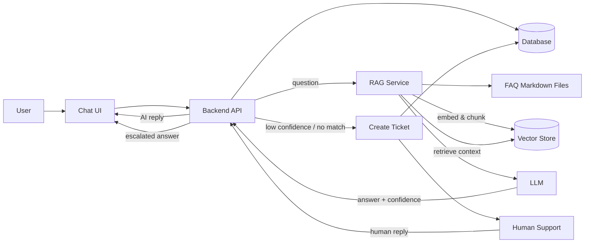
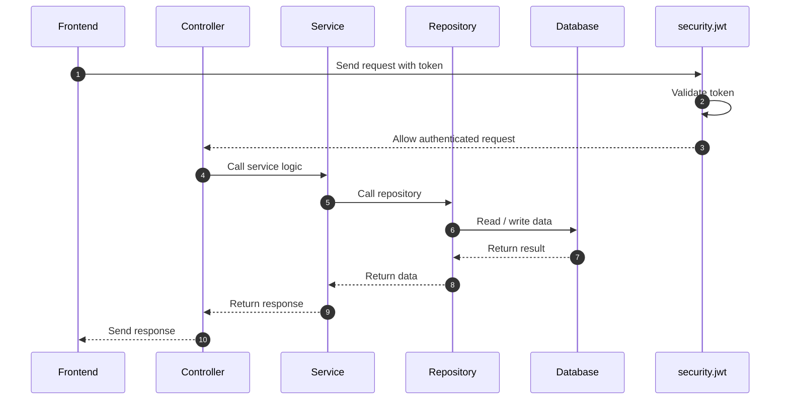

# AI-Deskhelp MVP Architecture

## Components
- **Chat UI**: Web chat front-end handling user sessions and message display.
- **Backend API**: Modular monolith (e.g., FastAPI/Express/Spring) exposing chat and ticket endpoints, coordinating RAG + LLM, enforcing auth/rate limits, logging.
- **RAG Service**: Module that chunks FAQ markdown, creates embeddings, retrieves top-k context for each query, and calls the LLM with retrieved snippets.
- **FAQ Markdown Files**: Editable knowledge base; ingested at startup or on change to refresh embeddings.
- **Vector Store**: Lightweight local embedding index (e.g., SQLite/FAISS-like) used for similarity search.
- **LLM**: Hosted model API that generates answers using provided context and returns confidence/coverage signals.
- **Database**: Relational store for users, chats, messages, retrieval metadata, and tickets.
- **Human Support**: Simple agent/admin console to pick up escalated tickets and post replies.

## Request & Escalation Flow
- **Normal flow**: User asks → Chat UI → Backend API → RAG retrieves FAQ context → LLM generates answer with confidence → API stores message/logs in DB → response returned to Chat UI.
- **Escalation flow**: If retrieval sparse or LLM confidence low → API creates ticket in DB → Human Support console handles it → human reply sent via API → Chat UI shows escalated answer and links ticket status.

## Simple Request Flow

-1.png>)

## Architecture

The application follows a simple layered architecture:

- **Frontend / UI** sends requests
- **Controller** handles HTTP endpoints
- **Service** contains business logic
- **Repository** manages database access
- **Database** stores the data

This keeps the project simple, clean, and scalable without overengineering.
